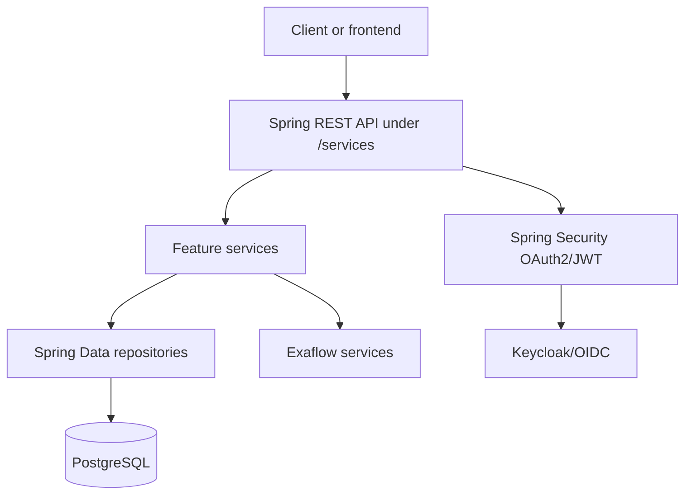

# Architecture

## App Type
This is a backend service for the Medical Informatics Platform. It is a Java 21 Spring Boot application built with Maven and packaged as a jar or Docker image.

## High-Level Structure
The application entrypoint is `hbp.mip.MIPApplication`. APIs are grouped by feature package:

- `algorithm`: exposes available algorithms, fetches algorithm metadata from Exaflow, and filters disabled algorithms.
- `datamodel`: exposes data models and dataset metadata from Exaflow, filtered by user claims when authentication is enabled.
- `experiment`: creates, lists, updates, deletes, and executes experiments; persists experiment records in PostgreSQL.
- `user`: resolves the active user from OAuth2/OIDC or JWT authentication and persists user profile/NDA state.
- `configurations`: configures security, OAuth2/OIDC, JWT authority mapping, persistence, Flyway, OpenAPI, and SPA redirects.
- `utils`: shared HTTP, JSON, logging, claim, resource, and exception utilities.

## Request and Data Flow
- HTTP requests enter controllers named `*API`.
- Controllers create a `hbp.mip.utils.Logger` with active user and endpoint context, then delegate to services.
- Services enforce business rules, authorization checks, external calls, and persistence workflows.
- Repositories and JPA `*DAO` entities handle database access for users and experiments.
- DTOs are returned from controllers as API response shapes.
- Exceptions are mapped by `ControllerExceptionHandler`.

## Module Boundaries
- Controllers should stay thin and avoid direct database or Exaflow logic.
- Services own feature behavior and should call repositories/utilities as needed.
- Repositories should stay focused on persistence and query helpers.
- Shared utilities should remain generic; feature-specific logic belongs in the feature package.
- Security behavior belongs in `configurations` and authorization helper logic in `ClaimUtils` or the owning service.

## Dependency Direction
Feature APIs depend on feature services. Feature services may depend on repositories, DTOs/DAOs, and shared utilities. Shared utilities should not depend on feature services. Configuration code may wire framework infrastructure but should not contain feature workflows.

## Persistence Layer
Persistence is configured in `PersistenceConfiguration`.

- Data source properties come from `spring.datasource`.
- Flyway runs at startup through a `flyway` bean.
- JPA scans `hbp.mip.experiment` and `hbp.mip.user`.
- Existing migration `V1__InitialSchema.sql` creates `user` and `experiment` tables.
- Hibernate is configured with `ddl-auto: validate`, so schema changes should be made through Flyway migrations.

## API Layer
The servlet context path is `/services`. Main endpoints include:

- `/algorithms`
- `/data-models`
- `/experiments`
- `/activeUser`

OpenAPI is configured by `OpenApiConfig` and springdoc dependencies.

## Authentication and Authorization
`SecurityConfiguration` supports:

- OAuth2 login for browser/session clients.
- JWT bearer token authentication for API clients.
- Keycloak/OIDC provider configuration.
- CSRF protection for cookie-authenticated clients, with bearer-token requests ignored.
- Raw authority mapping for claims and Keycloak roles, intentionally without adding a `ROLE_` prefix.
- Anonymous development behavior when `authentication.enabled` is disabled.

Authorization-sensitive logic appears in `ClaimUtils`, `ExperimentService`, `DataModelService`, and active user handling.

## Background Work and External Services
- `SpecificationsService` fetches inputdata, preprocessing, and algorithm specifications from Exaflow per request.
- `ExperimentService` starts a background `Thread` for persisted experiment execution.
- Data model and algorithm metadata are fetched through `HTTPUtil` using configured Exaflow URLs.

## Config and Environment Model
- All runtime config is in `src/main/resources/application.yml` with `${ENV:default}` placeholders.
- Containers pass environment variables (see `mip/deployment`); no separate config template is rendered at startup.
- Important config areas include datasource, OAuth2/Keycloak, authentication flags, Exaflow URLs, frontend base URL, `MIP_VERSION`, and logging.
- Do not introduce direct environment reads in business logic; route configuration through Spring properties.

## Known Gaps
- No committed `src/test/java` tree.
- No Maven wrapper.
- No Docker Compose or local database bootstrap file found.
- No dedicated Java lint/formatter/static-analysis command found.
- External service contracts for Exaflow are inferred from URLs and DTOs, not from a committed schema.
